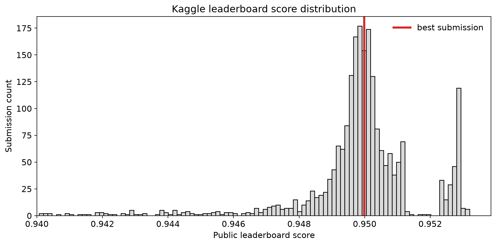

# student-health-risk

[](https://github.com/gperdrizet/student-health-risk/actions/workflows/verify_submission.yml) [](https://github.com/gperdrizet/student-health-risk/actions/workflows/submit.yml)

<!-- KAGGLE_BADGE_START -->

<!-- KAGGLE_BADGE_END -->

<!-- KAGGLE_RANK_PLOT_START -->

<!-- KAGGLE_RANK_PLOT_END -->

Kaggle Playground Series Season 6 Episode 7 solution. In addition to the S6E7 solution, this repository provides a convenient containerized development environment for Kaggle competitions, and an automated tag-driven submission workflow using GitHub Actions.


## Notebooks

1. [`01-EDA.ipynb`](https://github.com/gperdrizet/student-health-risk/blob/main/notebooks/01-EDA.ipynb): Data exploration and analysis of features and labels
2. [`02-gradient-boosting.ipynb`](https://github.com/gperdrizet/student-health-risk/blob/main/notebooks/02-gradient-boosting.ipynb): Basic Scikit-learn gradient boosting solution with minimal data preprocessing.
3. [`03-data-preprocessing.ipynb`](https://github.com/gperdrizet/student-health-risk/blob/main/notebooks/03-data-preprocessing.ipynb): Simple optimization of imputation and categorical feature encoding strategies, with Scikit-learn gradient boosting model trained on whole dataset for submission.
4. [`04-class-weight-tuning.ipynb`](https://github.com/gperdrizet/student-health-risk/blob/main/notebooks/04-class-weight-tuning.ipynb): Optimization of class weighting using a scale factor and cross-validation to prevent data leakage between folds.
5. [`05-feature-engineering.ipynb`](https://github.com/gperdrizet/student-health-risk/blob/main/notebooks/05-feature-engineering.ipynb): Leakage-safe engineered features built from the preprocessed fold artifacts.
6. [`06-gradient-boosting-baseline.ipynb`](https://github.com/gperdrizet/student-health-risk/blob/main/notebooks/06-gradient-boosting-baseline.ipynb): Optimized HistGradientBoosting baseline on engineered features with sampled search and full-fold reranking.
7. [`07-xgboost-baseline-engineered.ipynb`](https://github.com/gperdrizet/student-health-risk/blob/main/notebooks/07-xgboost-baseline-engineered.ipynb): GPU-capable sampled XGBoost optimization on engineered features with configurable fold/sampling controls.
8. [`08-xgboost-hillclimb-ensemble.ipynb`](https://github.com/gperdrizet/student-health-risk/blob/main/notebooks/08-xgboost-hillclimb-ensemble.ipynb): Weighted all-XGBoost hill-climbing ensemble with per-model row/feature bootstrapping and checkpoint submissions.

## Hill-climb runtime module

The hill-climbing search execution has been moved out of notebook 08 into a root package: [`hill_climbing_ensemble/`](hill_climbing_ensemble). The package provides a resumable Optuna-tracked search runtime with automatic checkpointing and run logs, while notebook 08 focuses on analysis and visualization of run artifacts.

Primary entrypoints:

- CLI module: `python -m hill_climbing_ensemble.cli`
- Wrapper script: [`scripts/run_hill_climb_ensemble.sh`](scripts/run_hill_climb_ensemble.sh)

Quick start:

```bash
# Safe smoke test with git actions disabled
./scripts/run_hill_climb_ensemble.sh --max-proposals 5 --target-accepted-models 2 --dry-run-git

# Full run with automatic submission/tag/push on accepted improvements
./scripts/run_hill_climb_ensemble.sh

# Optuna dashboard (after the run starts)
optuna-dashboard sqlite:///data/results/08-xgboost-hillclimb-optuna.db --host 0.0.0.0 --port 8081
```

Key artifacts:

- Optuna study DB: `data/results/08-xgboost-hillclimb-optuna.db`
- Runtime log: `logs/08-xgboost-hillclimb-runtime.log`
- Ensemble payload: `data/results/08-xgboost-ensemble.pkl`
- Final submission CSV: `data/submission.csv`

## Submissions

| Submission                 | Pull request | Estimated balanced accuracy | Leaderboard balanced accuracy | Leaderboard rank              |
|----------------------------|--------------|-----------------------------|-------------------------------|-------------------------------|
| 1. Majority class          | PR #10       | 33.3%                       | 33.3%                         | 1380                          |
| 2. Gradient boosting tree  | PR #12       | 86.6% - 87.2%               | 86.3%                         | 1184                          |
| 3. Optimized preprocessing | PR #15       | 86.9% - 87.7%               | 87.6%                         | 1855/2332 (~20th percentile)  |
| 4. Class weighting         | PR #17       | 94.8% - 95.0%               | 95.0%                         | 1084/2666 (~60th percentile)  |

## Submission workflow

The `submit.yml` workflow runs when a version tag like `v0.2.3` is pushed. It creates a GitHub Release, uploads the versioned submission CSV, submits that artifact to Kaggle, and then updates this README with the latest leaderboard badge and a score distribution plot.

The canonical submission file is `data/submission.csv`. Modeling notebooks overwrite this file directly, and the release workflow snapshots it to `data/submission.<tag>.csv` so every tagged submission records exactly what was sent to Kaggle.

Release notes are generated from [`.github/release.yml`](.github/release.yml), which groups commit messages by prefix such as `model:` and `feature:`.

### Required authentication setup

The execution layer requires configuration of two sensitive variables in your repository actions portal (`Settings -> Secrets and variables -> Actions`):

* `KAGGLE_USERNAME`: Your personal Kaggle account username.
* `KAGGLE_API_TOKEN`: A valid API Token string generated via your Kaggle user profile settings page.

### Local workflow instructions

To deploy, commit changes locally, use semantic prefix messages, and push your version tags from your terminal:

```bash
# 1. Commit and push data adjustments to update the release notes grouping
git add .
git commit -m "model: upgraded stacking ensemble with a LightGBM meta-learner"
git push origin main

# 2. Tag the release once the verification step passes green
git tag v1.0.0
git push origin v1.0.0
```


## Development environment

Development work is done in a Python 3.12 devcontainer which aims to recapitulate the Kaggle notebook environment. The environment and GitHub actions setup should be generally useful for Kaggle competitions. Please feel free to use this repository as a template for your own submissions:


### Prerequisites

1. Docker Desktop or Docker Engine
2. VS Code
3. git


### Steps

1. Fork and clone this repository
2. Open it in a devcontainer with VS Codes's `Dev Container: Open Folder in Container` command


## Helpful documentation

- [Kaggle CLI tutorial](https://github.com/Kaggle/kaggle-cli/blob/main/docs/tutorials.md)
- [GitHub workflow syntax](https://docs.github.com/en/actions/reference/workflows-and-actions/workflow-syntax)
- [GitHub actions marketplace](https://github.com/marketplace?type=actions)


## Citation

If you use any part of this repository in your own work, please cite it:

```
@misc{student-health-risk,
  author = {gperdrizet},
  title  = {student-health-risk},
  year   = {2026},
  url    = {https://github.com/gperdrizet/student-health-risk}
}
```


## License

This project is licensed under the [GNU General Public License v3.0](LICENSE).